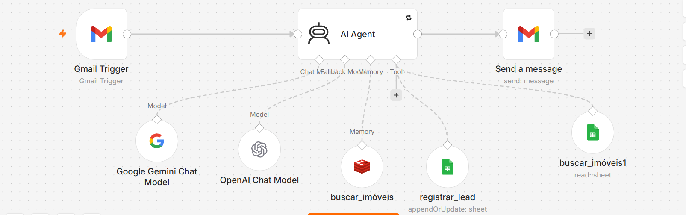
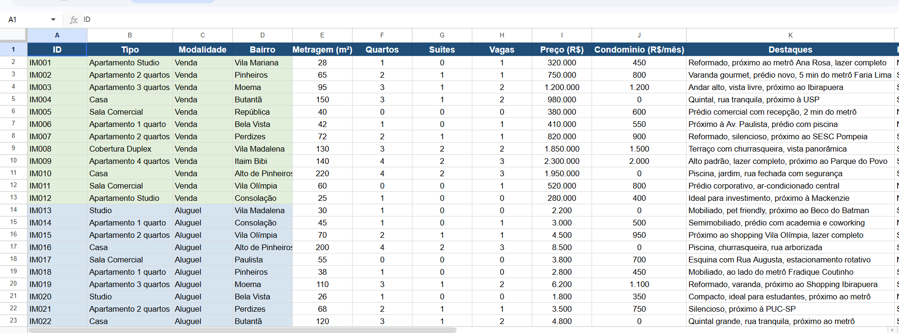
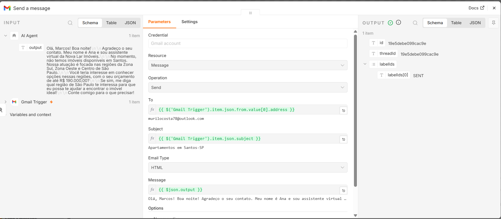
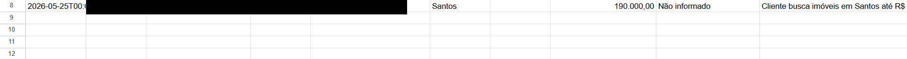
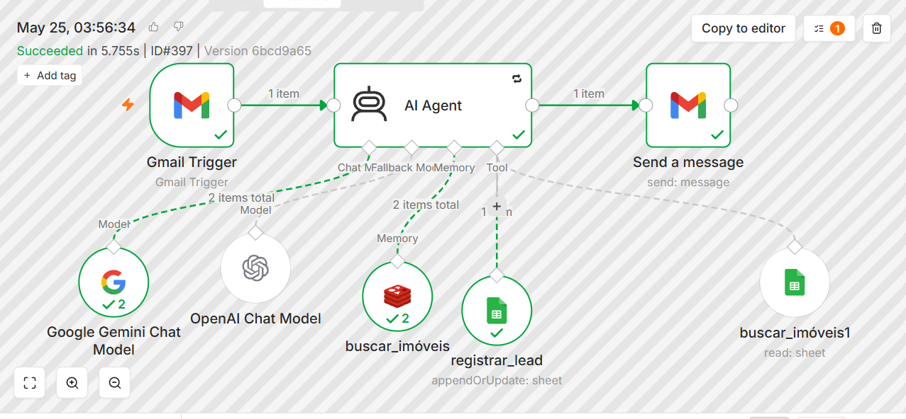

# AI Real Estate Assistant

## Objetivo

Automatizar o atendimento inicial de leads imobiliários utilizando IA Generativa, Gmail, Google Sheets e n8n.

O agente é capaz de:

- Ler e-mails automaticamente
- Identificar intenção do cliente
- Extrair informações relevantes
- Consultar imóveis disponíveis
- Registrar leads automaticamente
- Responder clientes utilizando IA
- Organizar dados em uma base CRM

---

## Tecnologias utilizadas

- n8n
- Google Gemini
- OpenAI
- Gmail Trigger
- Google Sheets
- Redis Memory
- AI Agent
- Prompt Engineering

---

## Fluxo da automação

1. Recebimento automático de e-mail
2. Interpretação da mensagem usando IA
3. Identificação de intenção:
   - compra
   - aluguel
   - região
   - orçamento
4. Consulta de imóveis disponíveis
5. Registro automático do lead no CRM
6. Resposta automática personalizada
7. Persistência de contexto com memória

---

## Funcionalidades

### Atendimento automatizado

O agente responde automaticamente dúvidas de clientes sobre imóveis.

### Registro automático de leads

Leads são registrados automaticamente no Google Sheets.

### Integração com Gmail e Outlook

O fluxo responde corretamente remetentes externos.

### Memória contextual

O agente mantém contexto usando Redis Memory.

### IA aplicada ao negócio

Uso de IA para:
- interpretação de intenção
- classificação
- resumo da conversa
- preenchimento automático de CRM

---

# Evidências

## Workflow completo

---

## Estrutura de CRM no Google Sheets

---

## Resposta automática por e-mail

---

## Ferramentas conectadas ao agente

---

## Execução concluída com sucesso

---

## Arquivo do workflow

O arquivo `n8n_workflow_sanitized.json` contém o fluxo exportado sem credenciais sensíveis.

---

## Possíveis evoluções

- Integração com WhatsApp
- Dashboard de leads
- Integração com CRM imobiliário
- Agendamento automático de visitas
- Busca vetorial com IA
- Multiatendimento
- RAG com documentos imobiliários

---

## Autor

Murilo Guimarães Costa

Especialista em Projetos de TI | Automação | IA aplicada a processos
